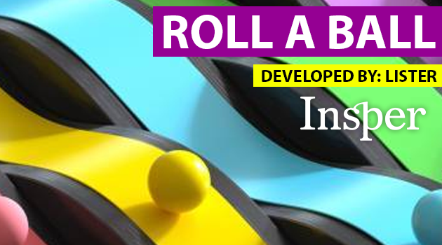

## Roll a Ball

---

#### Desenvolvido por: Lister Ogusuku Ribeiro

#### Engenharia de Computação - Insper 2023.2

**Link do jogo:** [Play Unity Roll A Ball by Lister](https://listeror.itch.io/roll-a-ball-lister-game)

---

**Sobre o Jogo:** O jogo a seguir foi desenvolvido com base no tutorial "Roll-a-Ball", disponibilizado pela Unity Learn e com orientações do professor Tiago Sanches e Técnico Pedro Emil, ambos da Engenharia de Computação do Insper.

---

**Funcionamento do Jogo:** O jogador principal possui somente 20 segundos para coletar todos os 10 quadradinhos espalhados ao seu redor. Para desafiar ainda mais, foram adicionadas algumas bolinhas inimigas que estarão circulando com a intenção de confundir e atrapalhar o jogador. Na tela haverá um cronômetro indicando quanto tempo ainda resta para o fim do jogo. Jogue apenas se você for ágil, atento e paciente. Boa sorte.

---

**Rubrica de acréscimo de pontos:**

Entregar o tutorial: D (4 pontos) --> ✅

Conquistando mais pontos:

a. Mecânica de Tempo (+2) --> ✅

b. Inimigos (mesmo se sejam formas básicas) (+2) --> ✅

c. Visual (+2) --> ✅

Adicionar música ao seu jogo (+1) --> ✅

Adicionar Audio Fx no seu jogo (+1) --> 0.5✅

**Rubrica de desconto de pontos:**

Sem Menu Inicial (-2) --> ✅ Jogo possui menu inicial.

Sem tratamento de dead-end (-2) --> ✅ Jogo possui tratamento de dead-end.

Página Itch.io mal construída (-1) --> ✅ Página bem construída e detalhada.

Entrega com atraso (-2/dia) --> ✅ Entrega feita no prazo.

Repositório não estava público (-1) --> ✅ Repositório está público.

Jogo não está em WebGL (-2) --> ✅ Jogo está em WebGL.

Plágio (-10) --> ✅ Jogo não possui plágio e os créditos aos conteúdos consultados estão abaixo.

---

**Créditos:** Para o desenvolvimento do jogo acima, foi de fundamental importância a consulta a outros tutoriais, códigos e conteúdos, os quais estão referenciados a seguir:

1. [Unity Roll-a-Ball Project](https://learn.unity.com/project/roll-a-ball?uv=2022.3)
2. [Unity Tutorial](https://www.youtube.com/watch?v=MGIBLPIz4oM)
3. [Game over screen](https://www.youtube.com/watch?v=K4uOjb5p3Io)
4. [Contador temporal](https://www.youtube.com/watch?v=wYzcMV1dIfg)
5. [Sound Effects in Unity](https://www.youtube.com/watch?v=mvaUho_a-q4)
6. [Criando inimigos no Unity](https://youtu.be/__wAQOSqIaw?si=0gruQrsB6oW_H5IS)
7. [Menu Principal em Unity](https://www.youtube.com/watch?v=yIaAE9bLxXI)
8. [Suspens Game Music](https://www.youtube.com/watch?v=_r2o3NdsfOA)
9. [Ele Gosta](https://www.youtube.com/watch?v=GzY9-ZaBaQE)
